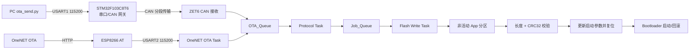

# STM32F103 A/B OTA 升级系统


一个面向 STM32F103ZE 的双分区 OTA 示例。项目支持通过 **CAN 转发链路**或 **ESP8266 + OneNET 云平台**下载固件，将新固件写入非活动分区，完成 CRC32 校验后切换启动分区；Bootloader 在新固件启动失败时可以回退到原分区。

项目同时加入了 FreeRTOS 任务解耦、传输 ACK/超时重发、包序号校验、芯片温度与 VDDA 健康监测，以及单 LED 状态指示。

> 本项目用于嵌入式 OTA 流程学习和原型验证。正式产品还应补充固件签名、加密传输、安全密钥存储、掉电测试和完整的硬件在环测试。

## 主要功能

- **A/B 双分区升级**：始终写入当前未运行的应用分区，校验通过后再更新启动目标。
- **失败回滚**：Bootloader 根据参数区中的升级状态和重试计数选择启动分区，新固件启动失败时切回原分区。
- **两种 OTA 入口**：
  - PC 串口 → STM32F103C8T6 → CAN → STM32F103ZE；
  - OneNET → Wi-Fi → ESP8266 AT 固件 → STM32F103ZE。
- **统一升级流水线**：CAN 和 OneNET 共用消息队列、Flash 作业队列和 CRC32 校验逻辑。
- **可靠传输**：包含 START / DATA / END 命令、16 位包序号、ACK、超时重发、重复包识别、长度与状态校验。
- **分段传输**：CAN 侧使用类似 ISO 15765 的单帧/首帧/连续帧分段方式，接收缓冲区为 512 字节。
- **Flash 保护**：升级前擦除目标分区，逐半字写入并回读校验，最大固件大小为 200 KiB。
- **设备健康监测**：TIM3 触发 ADC，DMA 采集内部温度传感器和 Vrefint，提供均值滤波、VDDA 补偿、过温/低压滞回告警和采集超时检测。
- **状态灯**：使用不同闪烁节奏显示联网、下载、Flash 写入、CRC 校验、升级成功、低压、过温及故障状态。

## 系统架构



接收、协议解析和 Flash 操作通过两级队列分开。耗时的擦除与写入不在 CAN 接收中断或协议解析路径中执行；但 STM32F103 使用片内 Flash，擦写期间仍可能影响 CPU 取指时序。

## Flash 布局

| 区域 | 起始地址 | 大小/用途 |
|---|---:|---|
| Bootloader | `0x08000000` | 预留到 `0x08004FFF` |
| App A | `0x08005000` | 200 KiB |
| App B | `0x08037000` | 200 KiB |
| 参数区 | `0x0807FC00` | 最后 2 KiB Flash 页，保存 magic number、升级状态、重试次数和启动目标 |

参数区被擦除或内容异常时，Bootloader 会用默认的 App A 配置重新初始化，避免因参数丢失而无法跳转。

## 工程目录

```text
.
├─ 07Bootloader/          STM32F103ZE Bootloader 与启动/回滚逻辑
├─ 14CAN_Tp_C8T6/        STM32F103C8T6 串口转 CAN 网关
├─ 18FreeRTOS项目/       STM32F103ZE FreeRTOS 应用、CAN/OneNET OTA
├─ tests/health_led/      可在 PC 上运行的业务逻辑测试
├─ ota_send.py            PC 端串口固件发送脚本
└─ HEALTH_LED_GUIDE.md    ADC 健康监测与 LED 状态的详细说明
```

FreeRTOS 应用包含 5 个业务任务：

| 任务 | 优先级 | 职责 |
|---|---:|---|
| `Protocol_Task` | 5 | 将 OTA 消息解析为擦除、写入和校验作业 |
| `OneNET_OTA_Task` | 4 | 入网、版本上报、任务查询、Range 分段下载和进度上报 |
| `LED_Task` | 3 | 按网络、OTA 和健康状态选择灯效 |
| `Health_Task` | 2 | 处理 ADC/DMA 快照，计算温度和 VDDA，生成告警 |
| `Flash_Write_Task` | 1 | 擦除、写入、回读、CRC32 校验和切换启动分区 |

## OTA 协议与执行流程

串口/CAN 升级由三个应用层命令组成：

| 命令 | 作用 | 关键数据 |
|---|---|---|
| `START (0x01)` | 开始会话并擦除非活动分区 | 固件总字节数 |
| `DATA (0x02)` | 按序写入固件块 | 16 位包序号 + 固件数据 |
| `END (0x03)` | 结束会话并进行完整校验 | PC 计算的 CRC32 |

PC 脚本使用 `[0xA5][命令][大端长度][负载]` 作为串口帧格式。C8T6 将长负载拆为 CAN 单帧或首帧/连续帧，ZET6 重组后放入 `OTA_Queue`。设备 ACK 包含原命令、执行状态和包序号，因此脚本可以区分超时、乱序、长度错误、Flash 错误、CRC 错误和队列满等情况。

完整升级过程如下：

1. 判断当前运行在 App A 还是 App B，并选取另一分区作为写入目标。
2. 校验固件大小，擦除目标分区的 100 个 2 KiB Flash 页。
3. 按块写入固件，每个半字写入后回读确认。
4. 检查实际接收长度并对目标 Flash 计算 CRC32。
5. 校验通过后更新参数区，将目标分区标记为待验证启动分区。
6. 设备复位，Bootloader 尝试启动新固件；应用成功运行后把 OTA 状态恢复为正常。
7. 如果待验证固件未能完成确认，Bootloader 根据重试状态回退到另一分区。

OneNET 链路不经过 C8T6，但会把下载到的分块转换为相同的 `START / DATA / END` 内部消息，因此两种升级入口共用 Flash 写入与校验代码。

仓库仍保留了早期的 Ymodem 相关实现，便于对照和扩展；当前主升级路径使用 CAN 自定义传输与 OneNET OTA，Bootloader 中的 Ymodem 入口默认被注释。

## 硬件连接

项目默认引脚如下。CAN 总线两端均需要 CAN 收发器，并应共地、按总线要求连接终端电阻。

| 设备 | 功能 | 引脚 |
|---|---|---|
| STM32F103C8T6 | USART1 TX / RX | PA9 / PA10 |
| STM32F103C8T6 | CAN TX / RX | PA12 / PA11 |
| STM32F103ZE | CAN TX / RX | PA12 / PA11 |
| STM32F103ZE | 调试串口 USART1 TX / RX | PA9 / PA10 |
| STM32F103ZE | ESP8266 USART2 TX / RX | PA2 / PA3 |
| STM32F103ZE | 状态 LED | PB5，默认低电平点亮 |

请确认 C8T6 与 ZET6 工程中的 CAN 时序参数一致。若使用不同系统时钟、晶振或 CAN 收发器，需要同步调整两端配置。

## 快速开始

### 1. 准备环境

- Keil MDK-ARM 5 和对应的 STM32F1 Device Pack；
- ST-Link/J-Link 或其他 STM32 下载器；
- Python 3.8+；
- `pyserial`，可通过下方命令安装：

```bash
python -m pip install -r requirements.txt
```

### 2. 编译与首次烧录

1. 打开 `07Bootloader/Project/STM32.uvprojx`，编译并将 Bootloader 烧录到 ZET6 的 `0x08000000`。
2. 打开 `18FreeRTOS项目/Project/STM32.uvprojx`，编译 App A，并烧录到 `0x08005000`。
3. 打开 `14CAN_Tp_C8T6/Project/STM32.uvprojx`，编译并烧录到 C8T6。
4. 完成串口、CAN 收发器和两块开发板之间的接线，然后复位设备。

> A、B 分区固件必须使用与运行地址一致的链接地址和中断向量表。生成 App B 固件时，将 IROM 起始地址改为 `0x08037000`，并启用 `system_stm32f10x.c` 中的 `IS_APP_B`；App A 使用 `0x08005000` 且不启用该宏。上传或发送前务必确认固件与目标分区匹配。

### 3. 通过 CAN 链路升级

编辑 `ota_send.py` 顶部的参数：

```python
SERIAL_PORT = "COM4"       # C8T6 所在串口
BAUD_RATE = 115200
FILE_PATH = "STM32.bin"    # 待升级固件
```

然后执行：

```bash
python ota_send.py
```

脚本按 256 字节拆包，发送固件大小、数据和 CRC32；每个命令等待设备 ACK，超时最多重试 3 次。校验成功后 ZET6 更新启动目标并自动复位。

### 4. 通过 OneNET 升级

在 `18FreeRTOS项目/BSP/onenet_ota.h` 中配置：

```c
#define ONENET_WIFI_SSID       "YOUR_WIFI_SSID"
#define ONENET_WIFI_PASSWORD   "YOUR_WIFI_PASSWORD"
#define ONENET_PRODUCT_ID      "YOUR_PRODUCT_ID"
#define ONENET_DEVICE_NAME     "YOUR_DEVICE_NAME"
#define ONENET_AUTH_TOKEN      "YOUR_ONENET_AUTHORIZATION_TOKEN"
```

应用启动后会通过 ESP8266 入网、上报版本并查询 OTA 任务；默认每 10 分钟查询一次。下载使用 HTTP Range 分段请求，写入过程上报进度，完成后进行长度和 CRC32 校验。

不要把真实 Wi-Fi 密码或 OneNET Token 提交到公开仓库。当前仓库仅保留占位符。

## LED 状态

| 状态 | 默认灯效 |
|---|---|
| 正常 | 亮 100 ms，灭 1900 ms |
| 未联网/通信失败 | 每 2 秒双闪 |
| OTA 下载 | 亮灭各 200 ms |
| Flash 擦写 | 常亮 |
| CRC 校验 | 每秒双闪 |
| OTA 成功 | 快闪 3 次后复位 |
| ADC/OTA 故障 | 三闪后停 1500 ms |
| 低压 | 亮灭各 250 ms |
| 过温 | 亮灭各 500 ms |

默认告警阈值为 75 ℃进入/70 ℃解除过温，3000 mV 进入/3100 mV 解除低压。采样原理、校准方法和完整灯效优先级见 [HEALTH_LED_GUIDE.md](HEALTH_LED_GUIDE.md)。

## PC 逻辑测试

Windows PowerShell 下执行：

```powershell
powershell -ExecutionPolicy Bypass -File tests/health_led/run.ps1
```

测试默认使用 `C:/msys64/ucrt64/bin/gcc.exe`，也可以指定其他 GCC：

```powershell
powershell -ExecutionPolicy Bypass -File tests/health_led/run.ps1 -Compiler "C:/path/to/gcc.exe"
```

测试覆盖温度/电压换算与滞回、过期数据、LED 优先级与节奏，以及 CAN 单帧/多帧、连续帧序号、异常长度和队列满重试。PC 测试不能替代 MCU 上的中断时序、Flash 掉电、网络异常和硬件在环测试。

## 升级安全说明

当前实现通过 A/B 分区、重试计数、写后回读和 CRC32 降低升级失败风险，但 **CRC32 只能检查传输错误，不能验证固件来源**。用于真实产品时建议增加：

- 固件数字签名与安全启动；
- HTTPS/TLS 与证书校验；
- 密钥安全存储和配置文件隔离；
- Flash 擦写期间的掉电保护与故障注入测试；
- 版本防回滚策略和升级包兼容性检查。

## 相关文档

- [ADC 健康监测和 LED 状态说明](HEALTH_LED_GUIDE.md)
- [Bootloader 工程](07Bootloader/)
- [C8T6 CAN 网关工程](14CAN_Tp_C8T6/)
- [FreeRTOS 应用工程](18FreeRTOS项目/)
